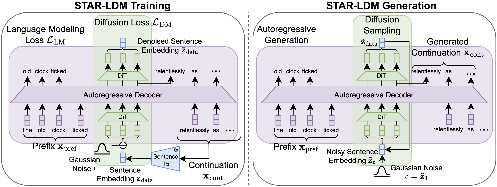

# STAR-LDM: Stop-Think-AutoRegress Language Diffusion Model

**[Stop-Think-AutoRegress: Language Modeling with Latent Diffusion Planning](https://openreview.net/forum?id=c05qIG1Z2B)**

Justin Lovelace, Christian Belardi, Sofian Zalouk, Adhitya Polavaram, Srivatsa Kundurthy, Kilian Q Weinberger

_Conference on Language Modeling (COLM) 2024_

---



## Abstract

The Stop-Think-AutoRegress Language Diffusion Model (STAR-LDM) integrates latent diffusion planning with autoregressive generation. Unlike conventional autoregressive language models limited to token-by-token decisions, STAR-LDM incorporates a ``thinking'' phase that pauses generation to refine a semantic plan through diffusion before continuing. This enables global planning in continuous space prior to committing to discrete tokens. Evaluations show STAR-LDM significantly outperforms similar-sized models on language understanding benchmarks and achieves >70% win rates in LLM-as-judge comparisons for narrative coherence and commonsense reasoning. The architecture also allows straightforward control through lightweight classifiers, enabling fine-grained steering of attributes without model retraining while maintaining better fluency-control trade-offs than specialized approaches.

## Code Release

Code will be released soon.

## Citation

```bibtex
@inproceedings{
lovelace2025stopthinkautoregress,
title={Stop-Think-AutoRegress: Language Modeling with Latent Diffusion Planning},
author={Justin Lovelace and Christian K Belardi and Sofian Zalouk and Adhitya Polavaram and Srivatsa R Kundurthy and Kilian Q Weinberger},
booktitle={Second Conference on Language Modeling},
year={2025},
url={https://openreview.net/forum?id=c05qIG1Z2B}
}
```